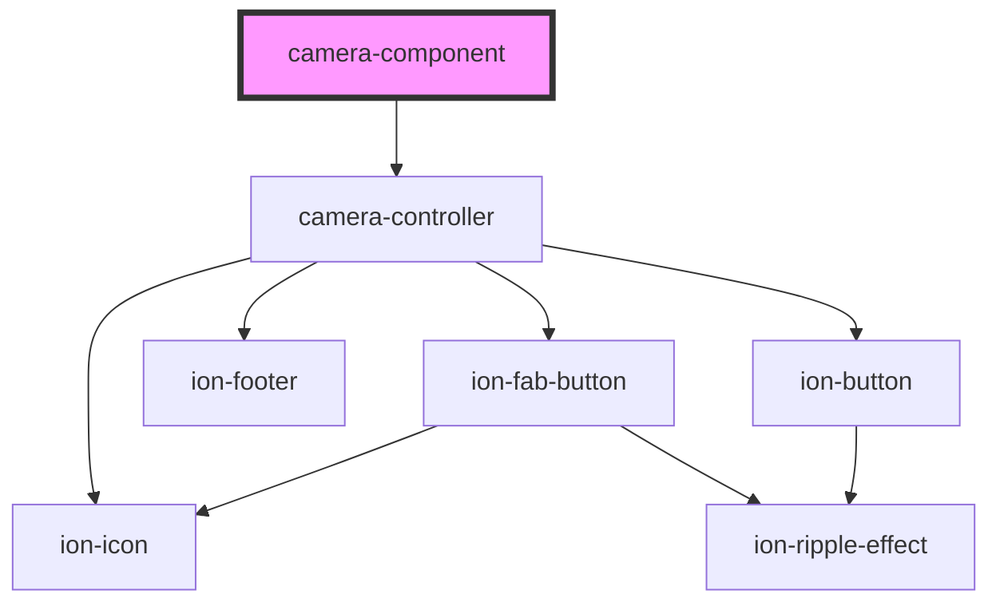
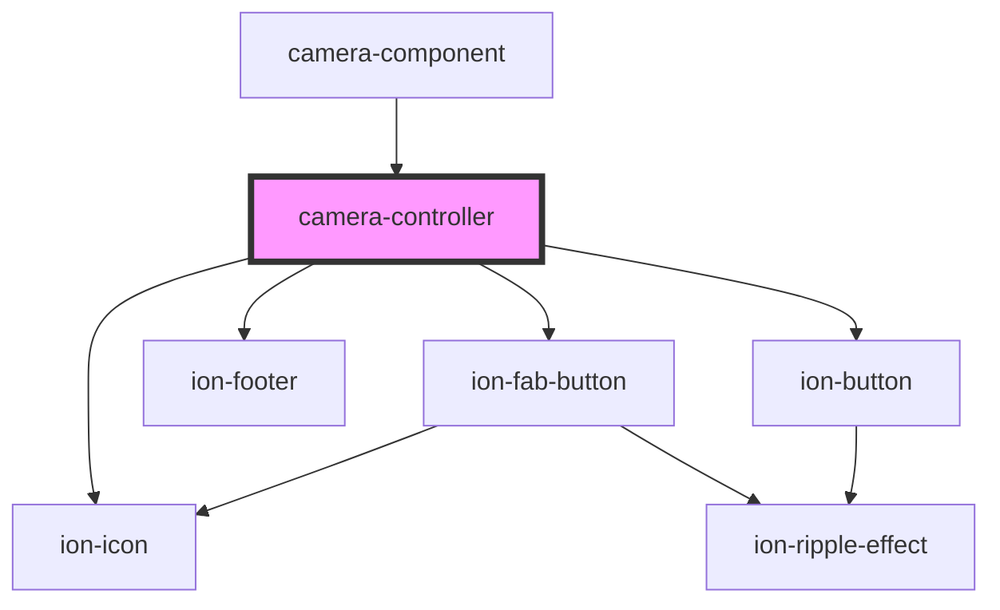

# JavaScript Camera Component

A Javascript camera component, made with Stencil.js. This is a web component and as such, it does not depend on any framework.

It works well with Angular, React, Vue, Stencil, JQuery, any other unimaginable framework or none at all.

# Install
## JS without any framework

Include the following scripts on the html page:

```html
<script type="module" src="https://unpkg.com/camera-component/dist/camera-component/camera-component.esm.js"></script>
<script nomodule src="https://unpkg.com/camera-component/dist/camera-component/camera-component.js"></script>

## Frameworks

Install using npm
```sh
npm install camera-component --save
```

or yarn
```sh
yarn add camera-component
```

## React

```js
// index.js
import React from 'react';
import ReactDOM from 'react-dom';
import './index.css';
import App from './App';
import registerServiceWorker from './registerServiceWorker';

import { applyPolyfills, defineCustomElements } from 'camera-component/loader';

ReactDOM.render(<App />, document.getElementById('root'));
registerServiceWorker();

applyPolyfills().then(() => {
  defineCustomElements(window);
});
```

```jsx
// App.jsx
import React from 'react';
import 'camera-component';

const App = () => {
    return <camera-component />
}

export default App;
```


## Angular

```ts
// app.module.ts
import { BrowserModule } from '@angular/platform-browser';
import { CUSTOM_ELEMENTS_SCHEMA, NgModule } from '@angular/core';
import { FormsModule } from '@angular/forms';

import { AppComponent } from './app.component';

@NgModule({
  declarations: [AppComponent],
  imports: [
    BrowserModule,
    FormsModule,
  ],
  bootstrap: [AppComponent],
  schemas: [CUSTOM_ELEMENTS_SCHEMA],
})
export class AppModule {}
```

```ts
// main.ts
import { enableProdMode } from '@angular/core';
import { platformBrowserDynamic } from '@angular/platform-browser-dynamic';

import { AppModule } from './app/app.module';
import { environment } from './environments/environment';

import { applyPolyfills, defineCustomElements } from 'camera-component/loader';

if (environment.production) {
  enableProdMode();
}

platformBrowserDynamic().bootstrapModule(AppModule)
  .catch(err => console.log(err));
applyPolyfills().then(() => {
  defineCustomElements()
})
```

```ts
// app.component.ts
import {Component, ElementRef, ViewChild} from '@angular/core';

import 'camera-component';

@Component({
    selector: 'app-home',
    template: `<camera-component #cam></camera-component>`,
    styleUrls: ['./home.component.scss'],
})
export class AppComponent {

    @ViewChild('cam') camComponent: ElementRef<HTMLCamComponentElement>;

    async onAction() {
        await this.camComponent.nativeElement.camComponentMethod();
    }
}
```

```html
// app.component.html
<camera-component />
```

## Stencil

```tsx
import { Component } from '@stencil/core';
import 'camera-component';

@Component({
  tag: 'camera',
  styleUrl: 'camera.scss'
})
export class Camera {

render() {
    return (
      <camera-component />
    );
  }
}
```


# Quick start: Camera component

This is the camera component, ready to start the cam. It works in two different modes: embedded or in a modal.

```html
<camera-component id="cam" show-preview="true"></camera-component>
<button onclick="cam.start()">Open the camera in embedded mode</button>
<button onclick="cam.start(1)">Open the camera in a modal</button>
<script>
    const cam = document.getElementById('cam');
    cam.addEventListener('picture', (e) => console.log('Picture in base 64:', e.detail));
    cam.addEventListener('backButton', () => console.log('backButton'));
    cam.addEventListener('webcamStop', () => console.log('webcamStop'));
</script>
```

See [documentation on Github](src/components/camera-component/readme.md) or [complete example](examples/camera-component.html)

# Quick start: Camera controller

This is the low level camera controller.

```html
<camera-controller id="cam"></camera-controller>
<button onclick="cam.flipCam()">Flip</button>
<button onclick="cam.takePicture()">Take picture</button>
<button onclick="cam.stopWebcam()">Stop cam</button>
<script>
    const cam = document.getElementById('cam');
    cam.addEventListener('picture', (e) => console.log('Picture in base 64:', e.detail.snapshot));
    cam.addEventListener('backButton', () => console.log('backButton'));
    cam.addEventListener('webcamStop', () => console.log('webcamStop'));
</script>
```

See [documentation on Github](src/components/camera-controller/readme.md) or [complete example](examples/camera-controller.html)

# API

# API camera-component


<!-- Auto Generated Below -->


## Properties

| Property            | Attribute              | Description                                                      | Type                                                | Default                      |
| ------------------- | ---------------------- | ---------------------------------------------------------------- | --------------------------------------------------- | ---------------------------- |
| `allowGallery`      | `allow-gallery`        | If true, allows taking picture from gallery                      | `boolean`                                           | `true`                       |
| `backButtonStopCam` | `back-button-stop-cam` | If true, stops cam when back button is pushed                    | `boolean`                                           | `true`                       |
| `orientation`       | `orientation`          | Camera selected - user: front camera - environtment: back camera | `CamOrientation.environment \| CamOrientation.user` | `CamOrientation.environment` |
| `showPreview`       | `show-preview`         | If true, shows image preview when snap                           | `boolean`                                           | `true`                       |


## Events

| Event        | Description                              | Type                |
| ------------ | ---------------------------------------- | ------------------- |
| `backButton` | Event emitted when back button is pushed | `CustomEvent<void>` |
| `picture`    | Event emitted when snap                  | `CustomEvent<any>`  |
| `webcamStop` | Event emitted when cam stop              | `CustomEvent<any>`  |


## Methods

### `start(camMode?: CamMode) => Promise<void>`

Method to open the camera

#### Returns

Type: `Promise<void>`


### `stop() => Promise<void>`

Method to stop the camera

#### Returns

Type: `Promise<void>`


## Dependencies

### Depends on

- [camera-controller](../camera-controller)

### Graph


----------------------------------------------

*Built with [StencilJS](https://stenciljs.com/)*


# API camera-controller


<!-- Auto Generated Below -->


## Properties

| Property            | Attribute              | Description                                                      | Type                                                | Default                      |
| ------------------- | ---------------------- | ---------------------------------------------------------------- | --------------------------------------------------- | ---------------------------- |
| `allowGallery`      | `allow-gallery`        | If true, allows taking picture from gallery                      | `boolean`                                           | `true`                       |
| `backButtonStopCam` | `back-button-stop-cam` | If true, stops cam when back button is pushed                    | `boolean`                                           | `true`                       |
| `camMode`           | `cam-mode`             | Camera mode                                                      | `CamMode.embedded \| CamMode.modal`                 | `undefined`                  |
| `height`            | `height`               | Video element height                                             | `number`                                            | `undefined`                  |
| `orientation`       | `orientation`          | Selected camera - user: front camera - environtment: back camera | `CamOrientation.environment \| CamOrientation.user` | `CamOrientation.environment` |
| `showPreview`       | `show-preview`         | If true, shows image preview when snap                           | `boolean`                                           | `true`                       |
| `width`             | `width`                | Video element width                                              | `number`                                            | `undefined`                  |


## Events

| Event        | Description                              | Type                |
| ------------ | ---------------------------------------- | ------------------- |
| `backButton` | Event emitted when back button is pushed | `CustomEvent<void>` |
| `picture`    | Event emitted when snap                  | `CustomEvent<any>`  |
| `webcamStop` | Event emitted when cam is stoped         | `CustomEvent<any>`  |


## Methods

### `flipCam() => Promise<void>`

Switch between front and back cam

#### Returns

Type: `Promise<void>`


### `resize(width: number, height: number) => Promise<void>`

Change the video element size

#### Returns

Type: `Promise<void>`


### `stopWebcam() => Promise<void>`

Stop the webcam
Emits webcamStop event

#### Returns

Type: `Promise<void>`


### `takePicture() => Promise<void>`

Captures the picture
Emits picture event

#### Returns

Type: `Promise<void>`


## Dependencies

### Used by

 - [camera-component](../camera-component)

### Depends on

- ion-fab-button
- ion-icon
- ion-footer
- ion-button

### Graph


----------------------------------------------

*Built with [StencilJS](https://stenciljs.com/)*


# Roadmap

[-] Share image: Twitter, Facebook, Instagram, Email, Linkedin
[-] Rotate image
[-] Scale image
[-] Button effects
[-] Image effects (sepia, black/white, ...)
[-] Video recorder
