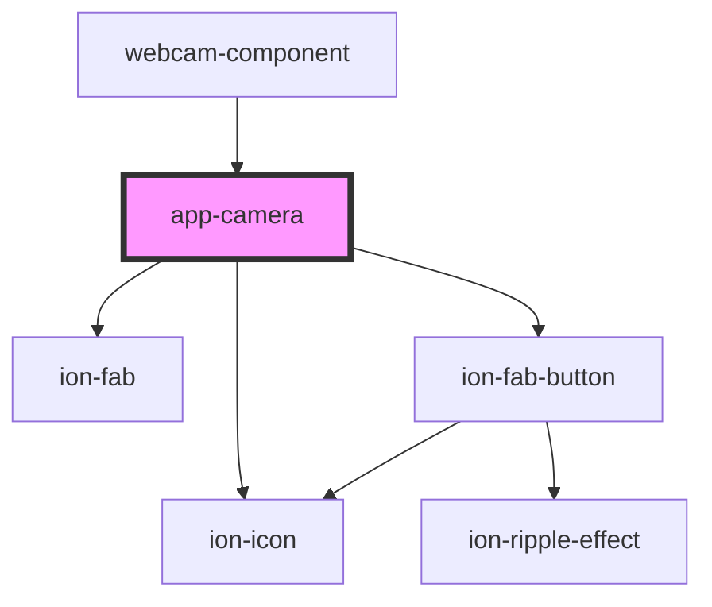

# app-camera

<!-- Auto Generated Below -->

## Events

| Event        | Description | Type               |
| ------------ | ----------- | ------------------ |
| `picture`    |             | `CustomEvent<any>` |
| `webcamStop` |             | `CustomEvent<any>` |

## Methods

### `close() => Promise<void>`

#### Returns

Type: `Promise<void>`

### `flipCam() => Promise<void>`

#### Returns

Type: `Promise<void>`

### `takePicture() => Promise<void>`

#### Returns

Type: `Promise<void>`

## Dependencies

### Used by

 - [webcam-component](../webcam-component)

### Depends on

- ion-fab
- ion-fab-button
- ion-icon

### Graph

----------------------------------------------

*Built with [StencilJS](https://stenciljs.com/)*
