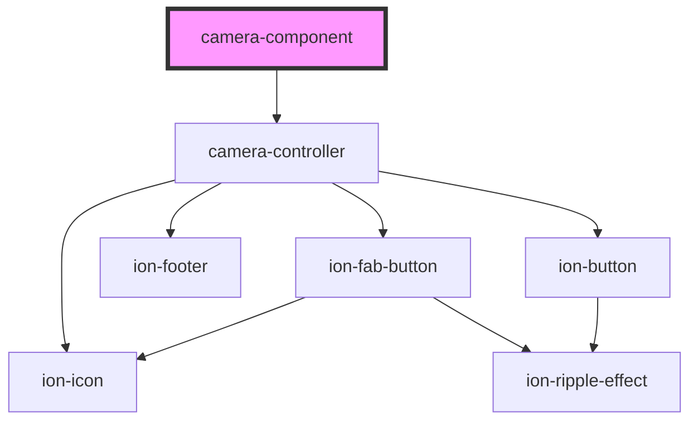

# camera-component

<!-- Auto Generated Below -->

## Properties

| Property            | Attribute              | Description                                   | Type                                | Default     |
| ------------------- | ---------------------- | --------------------------------------------- | ----------------------------------- | ----------- |
| `allowGallery`      | `allow-gallery`        | If true, allows taking picture from gallery   | `boolean`                           | `true`      |
| `backButtonStopCam` | `back-button-stop-cam` | If true, stops cam when back button is pushed | `boolean`                           | `true`      |
| `camMode`           | `cam-mode`             | Camera mode                                   | `CamMode.embedded \| CamMode.modal` | `undefined` |
| `showPreview`       | `show-preview`         | If true, shows image preview when snap        | `boolean`                           | `true`      |

## Events

| Event        | Description                              | Type                |
| ------------ | ---------------------------------------- | ------------------- |
| `backButton` | Event emitted when back button is pushed | `CustomEvent<void>` |
| `picture`    | Event emitted when snap                  | `CustomEvent<any>`  |
| `webcamStop` | Event emitted when cam stop              | `CustomEvent<any>`  |

## Methods

### `close() => Promise<void>`

#### Returns

Type: `Promise<void>`

### `open(camMode?: CamMode) => Promise<void>`

Method to open the camera

#### Returns

Type: `Promise<void>`

## Dependencies

### Depends on

- [camera-controller](../camera-controller)

### Graph

----------------------------------------------

*Built with [StencilJS](https://stenciljs.com/)*
