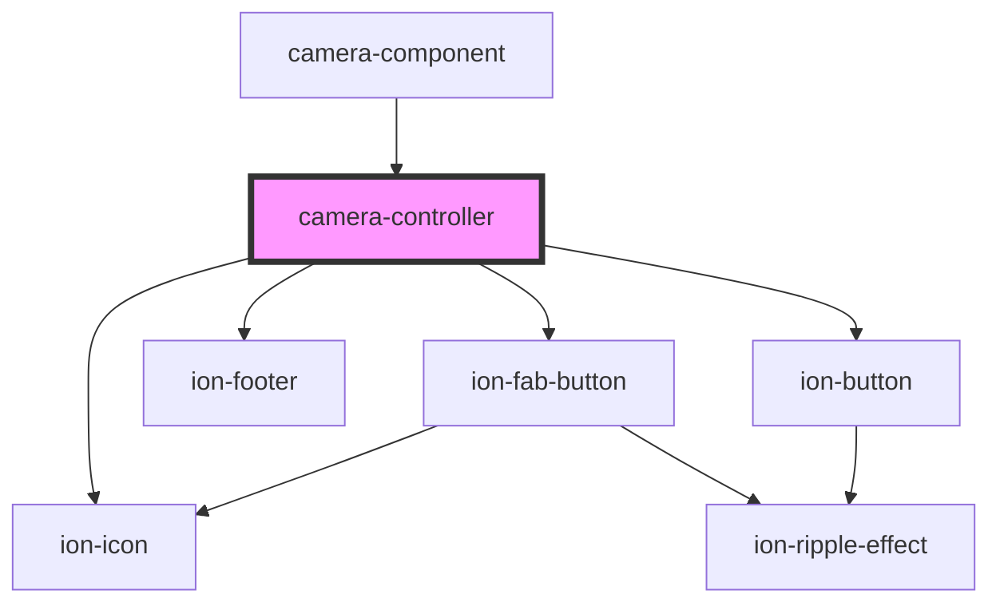

# app-camera

<!-- Auto Generated Below -->

## Properties

| Property            | Attribute              | Description                                   | Type      | Default     |
| ------------------- | ---------------------- | --------------------------------------------- | --------- | ----------- |
| `allowGallery`      | `allow-gallery`        | If true, allows taking picture from gallery   | `boolean` | `true`      |
| `backButtonStopCam` | `back-button-stop-cam` | If true, stops cam when back button is pushed | `boolean` | `true`      |
| `height`            | `height`               | Video element height                          | `number`  | `undefined` |
| `showPreview`       | `show-preview`         | If true, shows image preview when snap        | `boolean` | `true`      |
| `width`             | `width`                | Video element width                           | `number`  | `undefined` |

## Events

| Event        | Description                              | Type                |
| ------------ | ---------------------------------------- | ------------------- |
| `backButton` | Event emitted when back button is pushed | `CustomEvent<void>` |
| `picture`    | Event emitted when snap                  | `CustomEvent<any>`  |
| `webcamStop` | Event emitted when cam is stoped         | `CustomEvent<any>`  |

## Methods

### `flipCam() => Promise<void>`

Switch between front and back cam

#### Returns

Type: `Promise<void>`

### `stopWebcam() => Promise<void>`

Stop the webcam
Emits webcamStop event

#### Returns

Type: `Promise<void>`

### `takePicture() => Promise<void>`

Captures the picture
Emits picture event

#### Returns

Type: `Promise<void>`

## Dependencies

### Used by

 - [camera-component](../camera-component)

### Depends on

- ion-fab-button
- ion-icon
- ion-footer
- ion-button

### Graph

----------------------------------------------

*Built with [StencilJS](https://stenciljs.com/)*
